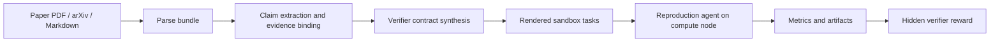

# ReproduceGym

ReproduceGym turns RL/ML papers into sandbox reproduction tasks with verifiable,
metric-based rewards. It is designed for the workflow where an agent reads a
paper, builds claim-level reproduction tasks, runs those tasks in an isolated
sandbox, and scores the result with a hidden verifier.

The central abstraction is an RLVR task:

```text
RLVR task = paper claim + recomputable metrics + paper-grounded targets + reward curves
```

Instead of treating a paper as one giant reproduction, ReproduceGym extracts the
paper's scientific claims, binds each claim to its supporting evidence, compiles
a verifier contract, renders ClawGym-compatible tasks, and runs an in-sandbox
reproduction agent on a chosen compute node.

## Why This Exists

Older task builds could produce runnable-looking tasks without explicit targets,
with directional thresholds such as `metric > 0`, or with rewards tied to verdict
labels. Those tasks were weak RLVR targets: a partial or failed reproduction
could still receive a misleading reward.

This version makes the contract stricter:

- Claims come from the paper text, not from reverse-engineering figures.
- Figures and tables are evidence for claims and sources for targets.
- Accepted RLVR tasks must have paper-grounded numeric `target_value` fields.
- Reward is computed from metric values and continuous reward curves, not from
  verdict strings.
- Metrics without grounded targets stay as diagnostics or go to `exploration`;
  they are not exposed as accepted RLVR tasks.

## Architecture

ReproduceGym separates the host control plane from remote compute. The host owns
parsing, task construction, secrets, verifier rendering, and trajectory capture.
Compute nodes are reached only by the in-sandbox reproduction agent when a task
needs GPUs.



The generated run directory is intentionally self-describing:

| Stage | Purpose | Main artifacts |
|---|---|---|
| `00-parse` | Paper text and figures | `paper.md`, `figures/`, `figures.index.json` |
| `01-extract` | Claims, evidence, and verification reports | `refined_claims.json`, `claim_verification_report.json` |
| `02-spec` | Canonical claim specs | `c001_slug.<spec_hash>.yaml` |
| `03-task` | ClawGym-compatible task directories | `task.md`, `data_entry.json`, `reward/check.py` |
| `04-run` | Reproduction attempts | `workspace/`, `trajectory/` |

Downstream systems should read `task_manifest.json`, which maps each accepted
claim to its exact task directory and `spec_hash`. Do not guess from hash
directories under `03-task/`.

Important directories:

```text
prompts/                 LLM/VL prompts for extraction and refinement.
reproducegym/pipeline/   Parse, build, render, and validation code.
reproducegym/schema/     Canonical claim spec schema.
reproducegym/verifier/   Reward recomputation engine.
agent_trace/             API-level trajectory capture.
config/                  Compute inventory examples and local inventories.
docs/                    Design notes and known gaps.
```

## Pipeline

The pipeline has three explicit stages:

1. **Parse**: convert a PDF, arXiv id, URL, or Markdown file into structured
   Markdown plus local figures.
2. **Build**: extract claims, bind evidence, compile verifier contracts, validate
   reward curves, and render accepted RLVR tasks.
3. **Run**: execute one already-rendered task with an in-sandbox reproduction
   agent and score the submitted artifacts.

The build stage is where most of the scientific filtering happens. It does not
launch a sandbox or GPU job. It may call text and vision model APIs, depending on
cache state and image parsing configuration.

For command-line recipes, flags, compute-node notes, and operational gotchas,
read `AGENTS.md`.

## How RLVR Task Selection Works

Task selection is claim-first:

1. Extract candidate claims from the whole paper text.
2. Rank/triage claims by importance, quantifiability, reproducibility, and cost.
3. Build claim-scoped evidence bundles from relevant paper slices, tables,
   captions, and figures.
4. Refine each claim into metrics, params, thresholds, and reproduction protocol.
5. Run deterministic contract synthesis:
   - normalize verifier-safe identifiers;
   - bind paper targets to metrics;
   - synthesize thresholds and reward curves;
   - move ungrounded metrics to diagnostics;
   - route tasks to `rlvr` or `exploration`.
6. Validate accepted tasks with schema checks, formula checks, target/reward
   checks, leak scans, hash consistency, and synthetic reward selftests.

Only accepted `rlvr` tasks are written to `task_manifest.json`. Rejected or
partial claims are still preserved in `01-extract/claim_verification_report.json`
with the reason they were routed to `exploration`.

## For Operators And Agents

README.md is intentionally high level. Use `AGENTS.md` as the operational
runbook. It contains the exact parse/build/run commands, expected artifact
paths, compute-node probing instructions, authentication pitfalls, runtime
budgeting rules, and cleanup procedures.

## Known Gaps

- Derived targets for ablation dominance and causal contrast are still limited.
  See `docs/derived-target-contract-gaps.md`.
- Visual curve targets depend on VL estimates and therefore use conservative
  tolerances.
- Some important claims remain in `exploration` when the paper lacks a numeric
  target, the figure read is ambiguous, or the reproduction parameters are
  incomplete.

## Development Notes

- The build stage can run without local GPUs; it uses API providers.
- The run stage may need remote GPUs depending on the task.
- `run.py` forces provider credentials from `.env` to avoid ambient shell
  variables pointing at the wrong relay.
- Generated `runs/` artifacts are gitignored.
- Keep scratch scripts out of commits unless they are promoted into tests or
  documented utilities.
