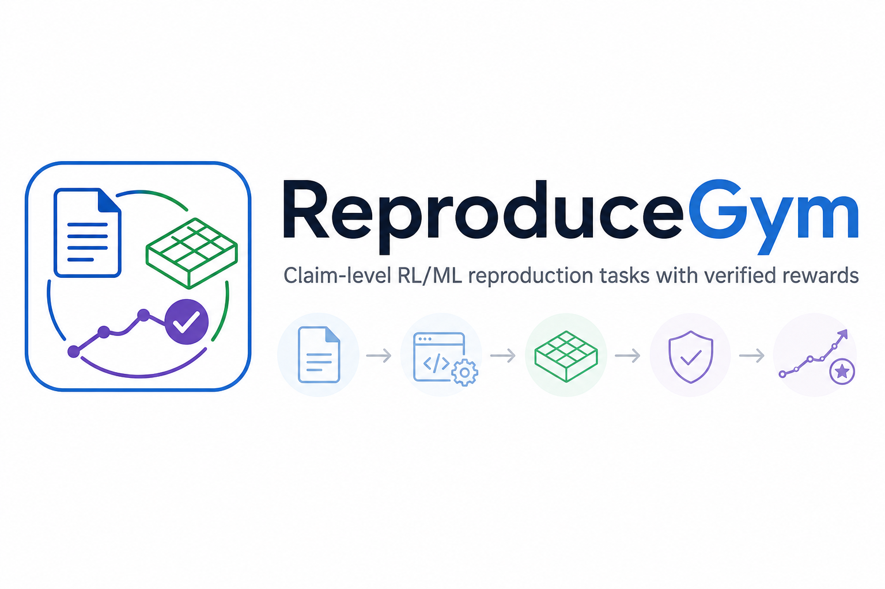
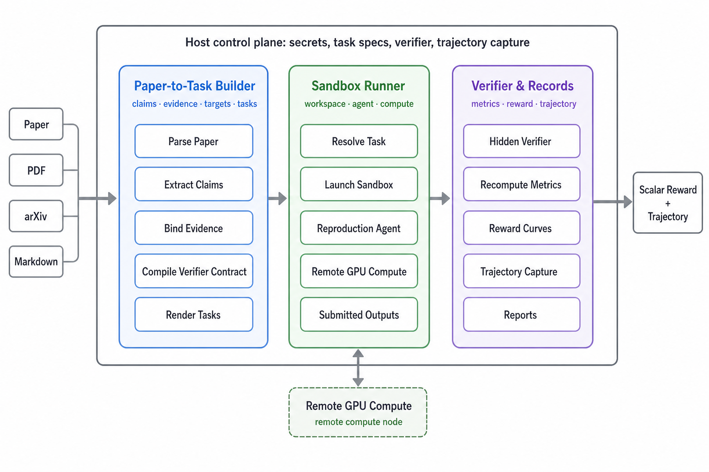

# ReproduceGym



ReproduceGym turns RL/ML papers into claim-level sandbox tasks with verifiable,
metric-based rewards. An agent can read a paper, build reproduction tasks, run
them in an isolated workspace, and receive a score from a hidden verifier.

The central abstraction is an RLVR task:

```text
RLVR task = paper claim + recomputable metrics + paper-grounded targets + reward curves
```

Instead of treating a paper as one large reproduction, ReproduceGym extracts the
paper's scientific claims, binds each claim to evidence, compiles a verifier
contract, renders ClawGym-compatible tasks, and runs an in-sandbox reproduction
agent on a chosen compute node.

## Why This Exists

Older task builds could look runnable while missing explicit targets, using
directional thresholds such as `metric > 0`, or tying reward to verdict labels.
Those tasks were weak RLVR targets: partial or failed reproductions could still
receive misleading rewards.

This version makes the contract stricter:

- Claims come from the paper text, not from reverse-engineering figures.
- Figures and tables are evidence for claims and sources for targets.
- Accepted RLVR tasks must have paper-grounded numeric `target_value` fields.
- Reward is computed from metric values and continuous reward curves, not from
  verdict strings.
- Metrics without grounded targets stay as diagnostics or go to `exploration`;
  they are not exposed as accepted RLVR tasks.

## Architecture

ReproduceGym has three moving parts: a builder that turns papers into task
specs, a runner that executes one task in a sandbox, and a verifier that
recomputes metrics and records the result. The host keeps secrets, task specs,
verifiers, and traces; remote machines only run the reproduction workload.



The main code follows the same split: paper parsing and task construction live
in `parse_paper.py`, `build_claim_tasks.py`, and `reproducegym/pipeline/`; task
execution starts from `run.py` and `reproducegym/sandbox/`; reward computation
and records live in `reproducegym/verifier/`, `agent_trace/`, and
`runs/<paper_id>/`.

Each generated run directory is self-describing: `00-parse` holds paper text and
figures, `01-extract` holds claims and evidence reports, `02-spec` holds
canonical claim specs, `03-task` holds rendered task directories, and `04-run`
holds reproduction attempts and trajectories. Downstream systems should read
`task_manifest.json` for accepted tasks, exact task directories, and
`spec_hash` values instead of guessing from hashed directories under `03-task/`.

Code map:

```text
prompts/                 LLM/VL prompts for extraction and refinement.
reproducegym/pipeline/   Parse, build, render, and validation code.
reproducegym/schema/     Canonical claim spec schema.
reproducegym/verifier/   Reward recomputation engine.
agent_trace/             API-level trajectory capture.
config/                  Compute inventory examples and local inventories.
docs/                    Design notes and known gaps.
```

## Pipeline

The workflow has three explicit stages:

1. **Parse**: convert a PDF, arXiv id, URL, or Markdown file into structured
   Markdown plus local figures.
2. **Build**: extract claims, bind evidence, compile verifier contracts, validate
   reward curves, and render accepted RLVR tasks.
3. **Run**: execute one already-rendered task with an in-sandbox reproduction
   agent and score the submitted artifacts.

Most scientific filtering happens during build. This stage does not launch a
sandbox or GPU job, but it may call text and vision model APIs depending on
cache state and image parsing configuration.

For command-line recipes, flags, compute-node notes, and operational gotchas,
use `AGENTS.md`.

## How RLVR Task Selection Works

Task selection is claim-first and target-gated:

1. Extract candidate claims from the whole paper text.
2. Rank/triage claims by importance, quantifiability, reproducibility, and cost.
3. Build claim-scoped evidence bundles from relevant paper slices, tables,
   captions, and figures.
4. Refine each claim into metrics, params, thresholds, and reproduction protocol.
5. Run deterministic contract synthesis:
   - normalize verifier-safe identifiers;
   - bind paper targets to metrics;
   - synthesize thresholds and reward curves;
   - move ungrounded metrics to diagnostics;
   - route tasks to `rlvr` or `exploration`.
6. Validate accepted tasks with schema checks, formula checks, target/reward
   checks, leak scans, hash consistency, and synthetic reward selftests.

Only accepted `rlvr` tasks are written to `task_manifest.json`. Rejected or
partial claims remain in `01-extract/claim_verification_report.json` with the
reason they were routed to `exploration`.

## For Operators And Agents

`README.md` is intentionally high level. Use `AGENTS.md` as the operational
runbook for exact parse/build/run commands, artifact paths, compute-node probes,
authentication pitfalls, runtime budgeting rules, and cleanup procedures.

## Known Gaps

- Derived targets for ablation dominance and causal contrast are still limited.
  See `docs/derived-target-contract-gaps.md`.
- Visual curve targets depend on VL estimates and therefore use conservative
  tolerances.
- Some important claims remain in `exploration` when the paper lacks a numeric
  target, the figure read is ambiguous, or the reproduction parameters are
  incomplete.

## Development Notes

- The build stage can run without local GPUs; it uses API providers.
- The run stage may need remote GPUs depending on the task.
- `run.py` forces provider credentials from `.env` to avoid ambient shell
  variables pointing at the wrong relay.
- Generated `runs/` artifacts are gitignored.
- Keep scratch scripts out of commits unless they are promoted into tests or
  documented utilities.
